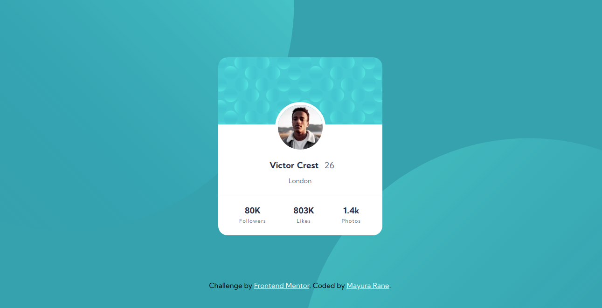
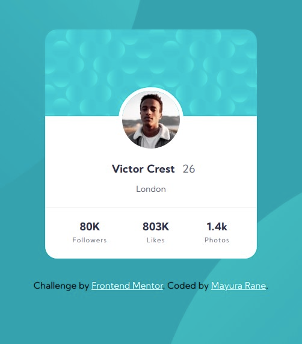

# Frontend Mentor - Profile card component solution

This is a solution to the [Profile card component challenge on Frontend Mentor](https://www.frontendmentor.io/challenges/profile-card-component-cfArpWshJ). Frontend Mentor challenges help you improve your coding skills by building realistic projects. 

## Table of contents

- [Overview](#overview)
  - [The challenge](#the-challenge)
  - [Screenshot](#screenshot)
  - [Links](#links)
- [My process](#my-process)
  - [Built with](#built-with)
  - [What I learned](#what-i-learned)
  - [Useful resources](#useful-resources)
- [Author](#author)
- [Acknowledgments](#acknowledgments)

## Overview

### The challenge

- Build out the project to the designs provided

### Screenshot

Desktop View:


Mobile View:


### Links

- Live Site URL: [Add live site URL here](https://your-live-site-url.com)

## My process

### Built with

- Semantic HTML5 markup
- CSS custom properties
- Flexbox

### What I learned

- Adding 2 images as background images
- More practice using flexbox

```css
background: url(images/bg-pattern-top.svg) no-repeat bottom 20vh right 51vw,
    url(images/bg-pattern-bottom.svg) no-repeat top 45vh left 50vw,
    hsl(185, 75%, 39%);
```

### Useful resources

- [W3 Schools](https://www.w3schools.com/css/css3_backgrounds.asp) - This helped me for adding 2 backgrounds.

## Author

- Frontend Mentor - [@MayuraRane](https://www.frontendmentor.io/profile/MayuraRane)
- Twitter - [@mayura_rane](https://www.twitter.com/mayura_rane)
- LinkedIn - [@mayurarane](https://www.linkedin.com/in/mayurarane/)

**Note: Delete this note and add/remove/edit lines above based on what links you'd like to share.**

## Acknowledgments

[@DrZubby](https://github.com/DrZubby/profile-card-component-main/blob/master/style.css) code dimentions for background image helped with the final outcome
